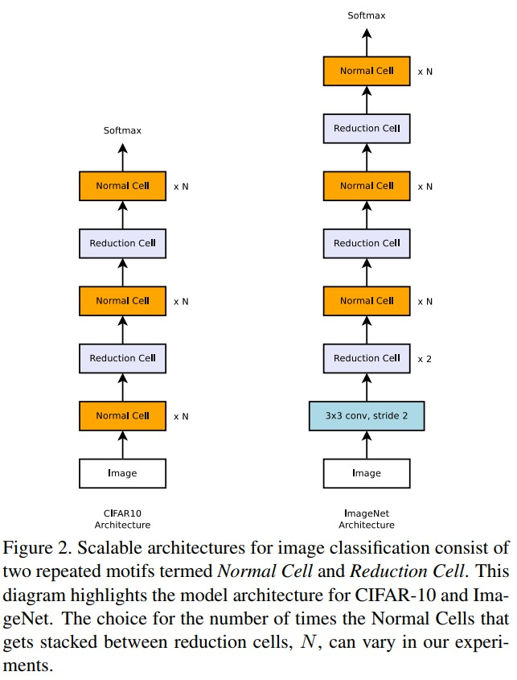
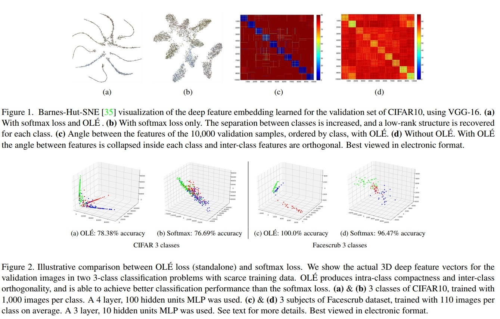

##  CVPR2018 papers 
***Keywords: embedding, metric learning, fine grained classification, zero-shot/one-shot/low-shot/few-shot learning, recognition***
<!-- TOC -->

- [ CVPR2018 papers ](#font-face-cvpr2018-papers-font)
    - [1. CLEAR: Cumulative LEARning for One-Shot One-Class Image Recognition](#1-clear-cumulative-learning-for-one-shot-one-class-image-recognition)
    - [2. Context Embedding Networks](#2-context-embedding-networks)
    - [3.CosFace: Large Margin Cosine Loss for Deep Face Recognition](#3cosface-large-margin-cosine-loss-for-deep-face-recognition)
    - [4.Deep Adversarial Metric Learning](#4deep-adversarial-metric-learning)
    - [5.Discriminative Learning of Latent Features for Zero-Shot Recognition](#5discriminative-learning-of-latent-features-for-zero-shot-recognition)
    - [6.Dynamic Few-Shot Visual Learning without Forgetting](#6dynamic-few-shot-visual-learning-without-forgetting)
    - [7.Feature Generating Networks for Zero-Shot Learning](#7feature-generating-networks-for-zero-shot-learning)
    - [8.Few-Shot Image Recognition by Predicting Parameters from Activations](#8few-shot-image-recognition-by-predicting-parameters-from-activations)
    - [9. Finding beans in burgers:Deep semantic-visual embedding with localization](#9-finding-beans-in-burgersdeep-semantic-visual-embedding-with-localization)
    - [10. Hierarchical Novelty Detection for Visual Object Recognition](#10-hierarchical-novelty-detection-for-visual-object-recognition)
    - [11. Large-scale Distance Metric Learning with Uncertainty](#11-large-scale-distance-metric-learning-with-uncertainty)
    - [12.Learning a Discriminative Filter Bank within a CNN for Fine-grained Recognition](#12learning-a-discriminative-filter-bank-within-a-cnn-for-fine-grained-recognition)
    - [13.Learning to Compare: Relation Network for Few-Shot Learning](#13learning-to-compare-relation-network-for-few-shot-learning)
    - [14.Learning Transferable Architectures for Scalable Image Recognition](#14learning-transferable-architectures-for-scalable-image-recognition)
    - [15.Low-Shot Learning from Imaginary Data](#15low-shot-learning-from-imaginary-data)
    - [16.Low-Shot Learning with Imprinted Weights](#16low-shot-learning-with-imprinted-weights)
    - [**17.Memory Matching Networks for One-Shot Image Recognition**](#font-color-orange17memory-matching-networks-for-one-shot-image-recognitionfont)
    - [18. Mining on Manifolds: Metric Learning without Labels](#18-mining-on-manifolds-metric-learning-without-labels)
    - [19.MoNet: Moments Embedding Network](#19monet-moments-embedding-network)
    - [20. OLE: Orthogonal Low-rank Embedding, A Plug and Play Geometric Loss for Deep Learning](#20-ole-orthogonal-low-rank-embedding-a-plug-and-play-geometric-loss-for-deep-learning)
    - [21. Recurrent Pixel Embedding for Instance Grouping](#21-recurrent-pixel-embedding-for-instance-grouping)
    - [22. Transductive Unbiased Embedding for Zero-Shot Learning](#22-transductive-unbiased-embedding-for-zero-shot-learning)
    - [23. Webly Supervised Learning Meets Zero-shot Learning: A Hybrid Approach for Fine-grained Classification](#23-webly-supervised-learning-meets-zero-shot-learning-a-hybrid-approach-for-fine-grained-classification)
    - [24. Zero-Shot Kernel Learning](#24-zero-shot-kernel-learning)
    - [25. Zero-shot Recognition via Semantic Embeddings and Knowledge Graphs](#25-zero-shot-recognition-via-semantic-embeddings-and-knowledge-graphs)
    - [26. Zero-Shot Sketch-Image Hashing](#26-zero-shot-sketch-image-hashing)
    - [27. Zero-Shot Visual Recognition using Semantics-Preserving Adversarial Embedding Networks](#27-zero-shot-visual-recognition-using-semantics-preserving-adversarial-embedding-networks)

<!-- /TOC -->

### 1. CLEAR: Cumulative LEARning for One-Shot One-Class Image Recognition
+ Abstrct  
This work addresses the novel problem of one-shot one-class classification. The goal is to estimate a classification decision boundary for a novel class based on a single image example. Our method exploits transfer learning to model the transformation from a representation of the input, extracted by a Convolutional Neural Network, to a classification decision boundary. We use a deep neural network to learn this transformation from a large labelled dataset of images and their associated class decision boundaries generated from ImageNet, and then apply the learned decision boundary to classify subsequent query images. We tested our approach on several benchmark datasets and significantly outperformed the baseline methods.
+ 摘要  
这篇文章主要解决one-shot, one-class的新问题。本文的目的是为一个只有一张图片的新类估计一个分类决策边界。我们的方法利用了迁移学习建立了从由CNN提取得到的输入表示，转化到分类决策边界的模型。我们使用了一个CNN来从大量已标注的数据集图片以及与其相关的，从ImageNet上得到的分类决策边界来学习这个转化模型，并且把学习到的决策边界应用到后续的query images的分类问题中。我们在几个基础数据集上测试了我们的方法并且明显优于基础的方法(baseline method)。
+ Overview   

+ Dataset  
Caltech-256, Oxford flowers 102,Caltech-UCSD Birds-200-2011 (CUB-200-2011), The MIT Indoor 67 scene recognition dataset, The SUN attribute database.

### 2. Context Embedding Networks
+ Abstrct  
Low dimensional embeddings that capture the main variations of interest in collections of data are important for  many applications. One way to construct these embeddings is to acquire estimates of similarity from the crowd. Similarity is a multi-dimensional concept that varies from individual to individual. However, existing models for learning crowd embeddings typically make simplifying assumptions such as all individuals estimate similarity using the same  criteria, the list of criteria is known in advance, or that the  crowd workers are not influenced by the data that they see.  To overcome these limitations we introduce Context Embedding Networks (CENs). In addition to learning interpretable embeddings from images, CENs also model worker biases for different attributes along with the visual context i.e. the attributes highlighted by a set of images. Experiments on three noisy crowd annotated datasets show  that modeling both worker bias and visual context results in more interpretable embeddings compared to existing approaches.
+ 摘要  
对于许多应用而言，在数据集合中捕捉主要的兴趣变化的低维嵌入(embedding)是非常重要的。一种建立这些embeddings的方法是获取人群相似性估计。相似性(similarity)是一种因个体而异的多维概念。但是，已有的学习人群embeddings模型都进行了简化假设，比如所有的个体使用同样的条件估计相似性，这些条件是提前一直的，或者人群的工作人员不受他们所看到的数据的影响。为了克服这些限制，我们提出了CEN网络。在从图片中学习可解释的embeddings的同时，CENs还为工作人员在视觉语境下对不同属性的偏差进行建模，比如被一系列的图片强调(highlight)的属性。在三个有噪声的人群标注数据集上的实验显示了同时为人工偏差和视觉语境建模与现有的方法相比达到了更好的解释性。
+ Overview  

+ Dataset  
略

### 3.CosFace: Large Margin Cosine Loss for Deep Face Recognition
+ Abstract  
Face recognition has made extraordinary progress owing to the advancement of deep convolutional neural networks (CNNs). The central task of face recognition, including face verification and identification, involves face feature discrimination. However, the traditional softmax loss of deep CNNs usually lacks the power of discrimination. To address this problem, recently several loss functions such as center loss, large margin softmax loss, and angular softmax loss have been proposed. All these improved losses share the same idea: maximizing inter-class variance and minimizing intra-class variance. In this paper, we propose a novel loss function, namely large margin cosine loss (LMCL) to realize this idea from a different perspective. More specifically, we reformulate the softmax loss as a cosine loss by L2 normalizing both features and weight vectors to remove radial variations, based on which a cosine margin term is introduced to further maximize the decision margin in the angular space. As a result, minimum intra-class variance and maximum inter-class variance are achieved by virtue of normalization and cosine decision margin maximization. We refer to our model trained with LMCL as CosFace. Extensive experimental evaluations are conducted on the most popular public-domain face recognition datasets such as MegaFace Challenge, Youtube Faces (YTF) and Labeled Face in the Wild (LFW). We achieve the state-of-the-art performance on these benchmarks, which confirms the effectiveness of our proposed approach.
+ 摘要  
人脸识别随着CNN的发展已经有了非常惊人的进步。人脸识别的中心任务包括人脸确认和辨别，涉及到人脸特征判别。然而，传统的CNN的softmax loss经常缺乏判别的能力。为了解决这个问题，近来一些损失函数，比如center loss, large margin softmax loss, and angular softmax loss被提出来了。所有这些改进的loss都有共同的思想：最大化类间方差而最小化类内方差。本文，我们提出了一种新的损失函数，即large margin cosin loss(LMCL)，以从另外的角度实现这个思想。更具体地说，我们将软最大损失重新定义为余弦损失，它使两个特征和权重向量都标准化，以消除径向变化，在此基础上引入了余弦的边缘项，以进一步最大化角度空间的决策边界。因此，通过规范化和余弦决策边界的最大化，实现了最小化类内方差和最大化类间方差。我们的模型是用LMCL作为CosFace训练的。我们在最流行的公共领域人脸识别数据集上进行了广泛的实验评估，如MegaFace Challenge、Youtube Faces(YTF)和LFW。我们在这些基准上取得了最先进的性能，这证实了我们提出的方法的有效性。
+ Overview  

+ Dataset
略
+ Main idea  
  **loss function** 

### 4.Deep Adversarial Metric Learning
+ Abstract  
Learning an effective distance metric between image pairs plays an important role in visual analysis, where the training procedure largely relies on hard negative samples. However, hard negatives in the training set usually account for the tiny minority, which may fail to fully describe the distribution of negative samples close to the margin. In this paper, we propose a deep adversarial metric learning (DAML) framework to generate synthetic hard negatives from the observed negative samples, which is widely applicable to supervised deep metric learning methods. Different from existing metric learning approaches which simply ignore numerous easy negatives, the proposed DAML exploits them to generate potential hard negatives adversarial to the learned metric as complements. We simultaneously train the hard negative generator and feature embedding in an adversarial manner, so that more precise distance metrics can be learned with adequate and targeted synthetic hard negatives. Extensive experimental results on three benchmark datasets including CUB-200-2011, Cars196 and Stanford Online Products show that DAML effectively boosts the performance of existing deep metric learning approaches through adversarial learning.
+ 摘要  
学习一种图像对之间有效的距离度量方法在视觉分析中起到很重要的作用，视觉分析在训练过程中非常依赖困难的负样本。然而，训练集中困难的负样本经常只占很少的部分，这可能不能完全描述接近边缘的负样本的分布。在本文中，我们提出了一种深度对抗式度量学习(DAML)框架来从观察到的生成人造的困难负样本,该方法可以广泛应用于碱度式度量学习方法中。与已有的度量学习方法简单忽视大量的简单负样本不同的是，DAML方法利用了这些样本作为补充。我们同时以对抗的方式训练困难负样本生成器和特征embedding，以便于可以通过足够的和有针对性的人造困难负样本学到更加精确的距离度量。在三个基准数据库，包括CUB-200-2001,Cars106和Stanford Online Products上面的广泛的实验结果展示了DAML通过对抗式学习有效地提升了现有的深度度量学习方法的性能。
+ Overview

+ Dataset  
*CUB-200-2011, Cars196 and Stanford Online Products*
+ Main idea  
通过对抗式网络生成更多的hard negative samples，提升embedding模型的performance
+ 相似论文  
7，使用GAN

### 5.Discriminative Learning of Latent Features for Zero-Shot Recognition
+ Abstract  
Zero-shot learning (ZSL) aims to recognize unseen image categories by learning an embedding space between image and semantic representations. For years, among existing works, it has been the center task to learn the proper mapping matrices aligning the visual and semantic space, whilst the importance to learn discriminative representations for ZSL is ignored. In this work, we retrospect existing methods and demonstrate the necessity to learn discriminative representations for both visual and semantic instances of ZSL. We propose an end-to-end network that is capable  of 1) automatically discovering discriminative regions by a zoom network; and 2) learning discriminative semantic representations in an augmented space introduced for both  user-defined and latent attributes. Our proposed method is tested extensively on two challenging ZSL datasets, and the  experiment results show that the proposed method significantly outperforms state-of-the-art methods.
+ 摘要  
Zero-shot学习(ZSL)旨在通过学习一个图片和寓意表达之间的embedding空间，以识别未见过的图片种类。多年来，在众多已有的工作中，这已经成为学习一个合适的映射矩阵以调整视觉和语义空间已经成为了中心任务，而对ZSL的鉴别表示学习的重要性被忽视了。在我们的工作中，我们回顾已有的方法并且证明了学习鉴别式表示对ZSL的视觉和语义实例的必要性。我们提出了一种end-to-end的网络，该网络具有以下一些性能：1)通过一个缩放网络(zoom networks)，自动发现有区别的区域；2)在一个为用户预定义和潜在的属性引入的增广空间中，学习有区别的语义表示。我们提出的方法在两个具有挑战性的ZSL数据集上进行了广泛的测试，实验结果表明提出的方法明显优于现在最先进的方法。
+ Overview  

+ Dataset  
*Animals with Attributes, CUB-200-2011.*

### 6.Dynamic Few-Shot Visual Learning without Forgetting
+ Abstract  
The human visual system has the remarkably ability to be able to effortlessly learn novel concepts from only a few examples. Mimicking the same behavior on machine learning vision systems is an interesting and very challenging  research problem with many practical advantages on real world vision applications. In this context, the goal of our work is to devise a few-shot visual learning system that during test time it will be able to efficiently learn novel categories from only a few training data while at the same  time it will not forget the initial categories on which it was  trained (here called base categories). To achieve that goal we propose (a) to extend an object recognition system with an attention based few-shot classification weight generator,  and (b) to redesign the classifier of a ConvNet model as the  cosine similarity function between feature representations and classification weight vectors. The latter, apart from unifying the recognition of both novel and base categories, it also leads to feature representations that generalize better on unseen  categories. We extensively evaluate our approach on  Mini-ImageNet where we manage to improve the prior state-of-the-art on few-shot recognition (i.e., we achieve 56.20%  and 73.00% on the 1-shot and 5-shot settings respectively)  while at the same time we do not sacrifice any accuracy  on the base categories, which is a characteristic that most prior approaches lack. Finally, we apply our approach on the recently introduced few-shot benchmark of Bharath and Girshick [4] where we also achieve state-of-the-art results.
+ 摘要
人类的视觉系统具有出色的能力可以从几个例子中轻松学习新的概念。在机器学习视觉系统上模仿这种行为是一个有趣的并且具有挑战性的研究问题，该研究在现实世界视觉应用中具有许多实际的优点。在这个背景下，我们工作的目的是设计一个few-shot的视觉学习系统，该系统在测试时可以有效地从仅有的几个训练数据中学习新的种类，并且在同时他系统不会忘记初始的已经训练过的种类（我们在这里称之为基础类）。为了达到这个目的，我们提出了(a)通过一个以注意力为基础的few-shot分类权重生成器，扩展物体识别系统，(b)重新设计卷积模型分类器，作为特征表示和分类权重向量之间的cosine相似性函数。后者，除了统一对新的和基础类识别之外，它还带来了在没有见过的新类上更好的泛化特征表示。我们在Mini-ImageNet上对我们的方法进行了广泛的评估，在该数据集上，我们试图提高先前的最先进的few-shot识别性能（比如我们在1-shot和5-shot上分别达到了56.20%和73.00%的准确率），同时，我们并没有牺牲基础类的准确率，这是此前的大多数方法都不具有的特点。最后，我们把我们的方法应用到最近新引进的基准Bharath and  Girshick，并且取得了目前最好的结果。
+ Overview  

### 7.Feature Generating Networks for Zero-Shot Learning
+ Abstract  
Suffering from the extreme training data imbalance between seen and unseen classes, most of existing state-of-the-art approaches fail to achieve satisfactory results for the challenging generalized zero-shot learning task. To circumvent the need for labeled examples of unseen classes, we  propose a novel generative adversarial network (GAN) that synthesizes CNN features conditioned on class-level semantic information, offering a shortcut directly from a semantic descriptor of a class to a class-conditional feature distribution. Our proposed approach, pairing a Wasserstein GAN with a classification loss, is able to generate sufficiently discriminative CNN features to train softmax classifiers or any multimodal embedding method. Our experimental results  demonstrate a significant boost in accuracy over the state of the art on five challenging datasets CUB, FLO, SUN, AWA and ImageNet in both the zero-shot learning and generalized zero-shot learning settings.
+ 摘要  
受到训练数据中见过的和未见过的类别极度不平衡的困扰，大多数现有的最先进的方法都不能在具有挑战性的普适的zero-shot学习任务中达到令人满意的结果。为了避免对未见过的类的示例的标签的需求，我们提出了一种新的GAN网络，提供了一种直接的从一个类的语义描述到类条件特征分布的捷径。我们提出的方法，将Wasserstein GAN与分类损失配对，可以产生足够的可以辨别的CNN特征，以训练softmax分类器或者任何多峰的embedding方法。我们的实验结果证明了在zero-shot学习广义的zero-shot环境中，目前5个最具有挑战性的数据集CUB,FLO,SUN,AWA和ImageNet上，准确率得到了显著的提升，
+ Overview  

+ Main idea  
使用GAN网络解决未见过的类比较少的问题
+ 相似论文  
4，使用GAN
### 8.Few-Shot Image Recognition by Predicting Parameters from Activations
+ Abstract  
In this paper, we are interested in the few-shot learning  problem. In particular, we focus on a challenging scenario  where the number of categories is large and the number of  examples per novel category is very limited, e.g. 1, 2, or 3.  Motivated by the close relationship between the parameters  and the activations in a neural network associated with the  same category, we propose a novel method that can adapt  a pre-trained neural network to novel categories by directly  predicting the parameters from the activations. Zero training is required in adaptation to novel categories, and fast  inference is realized by a single forward pass. We evaluate  our method by doing few-shot image recognition on the ImageNet dataset, which achieves the state-of-the-art classification accuracy on novel categories by a significant margin  while keeping comparable performance on the large-scale  categories. We also test our method on the MiniImageNet  dataset and it strongly outperforms the previous state-ofthe-art methods
+ 摘要  
在本文中，我们感兴趣的是few-shot学习问题。特别地，我们关注的是一个具有挑战性的场景，其中类别的数量很大，每个新类别的示例数量非常有限，例如1、2或3。在与同一类别相关的神经网络中参数与激活之间的密切关系的激励下，我们提出了一种新颖的方法，可以通过直接预测激活的参数来适应预先训练的神经网络。对新类别的适应不需要训练，而快速推理则是通过单一的前向实现的。我们通过在ImageNet数据集上做few-shot图像识别来评估我们的方法，它在新的类别中获得了最先进的分类精度，同时在大型类别中保持了可比较的性能。我们还在MiniImageNet数据集上测试我们的方法，它的性能远远超过了以前的状态方法。
+ Overview   

### 9. Finding beans in burgers:Deep semantic-visual embedding with localization
+ Abstract  
Several works have proposed to learn a two-path neural  network that maps images and texts, respectively, to a same  shared Euclidean space where geometry captures useful semantic relationships. Such a multi-modal embedding can be  trained and used for various tasks, notably image captioning. In the present work, we introduce a new architecture  of this type, with a visual path that leverages recent spaceaware pooling mechanisms. Combined with a textual path  which is jointly trained from scratch, our semantic-visual  embedding offers a versatile model. Once trained under the  supervision of captioned images, it yields new state-of-theart performance on cross-modal retrieval. It also allows the  localization of new concepts from the embedding space into  any input image, delivering state-of-the-art result on the visual grounding of phrases.
+ 摘要  
一些工作已经提出了学习双路神经网络，将图像和文字分别映射到同一个共享的欧式空间中，在这个空间中，几何信息包含了有用的语言关系。这样一个多峰的embedding可以被训练和使用在不同的任务上，特别是图像字幕。在目前的工作中，我们引进了一个新的这种类型的结构，并使用最近的spaceaware池化机制的可视路径。结合了从头开始训练的文本路径，我们的语义-视觉嵌入提供了一个多用途的模型。一旦在字幕图像的监督下进行训练，就会产生新的跨模式检索的先进的性能。它还允许将新概念从嵌入空间中定位到任何输入图像中，在短语的视觉基础上提供最先进的结果。
+ Overview  

### 10. Hierarchical Novelty Detection for Visual Object Recognition
+ Abstract  
Deep neural networks have achieved impressive success in large-scale visual object recognition tasks with a predefined set of classes. However, recognizing objects of novel classes unseen during training still remains challenging. The problem of detecting such novel classes has been addressed in the literature, but most prior works have focused on providing simple binary or regressive decisions, e.g., the  output would be known, novel, or corresponding confidence intervals. In this paper, we study more informative novelty detection schemes based on a hierarchical classification framework. For an object of a novel class, we aim for finding its closest super class in the hierarchical taxonomy of known classes. To this end, we propose two different  approaches termed top-down and flatten methods, and their combination as well. The essential ingredients of our methods are confidence-calibrated classifiers, data relabeling, and the leave-one-out strategy for modeling novel classes  under the hierarchical taxonomy. Furthermore, our method can generate a hierarchical embedding that leads to improved generalized zero-shot learning performance in combination with other commonly-used semantic embeddings.
+ 摘要  
深度神经网络在大规模的一组预定义的类的可视对象识别任务中取得了令人印象深刻的成功。然而，在训练中识别新的类别的物体仍然具有挑战性。在文献中已经讨论了检测此类新类的问题，但是大多数先前的工作都集中在提供简单的二进制或回归的决策上，例如，输出将是已知的、新颖的或相应的置信区间。本文研究了基于层次分类框架的更有意义的新异类检测方案。为此，我们提出了两种不同的方法，称为自顶向下和扁平方法，以及它们的组合。我们方法的基本要素是confidence-calibrated分类器,数据重标注，以及在层次分类下为新类建模的留一（leave-one-out）策略。此外，我们的方法可以生成层次化的嵌入，从而与其他常用的语义嵌入相结合，从而改进广义的zero-shot学习性能。
+ Overview  

+ Main idea  
专注于检测，也许对embedding有借鉴作用

### 11. Large-scale Distance Metric Learning with Uncertainty
+ Abstract  
Distance metric learning (DML) has been studied extensively in the past decades for its superior performance with distance-based algorithms. Most of the existing methods propose to learn a distance metric with pairwise or triplet constraints. However, the number of constraints is quadratic or even cubic in the number of the original examples, which makes it challenging for DML to handle the  large-scale data set. Besides, the real-world data may contain various uncertainty, especially for the image data. The  uncertainty can mislead the learning procedure and cause  the performance degradation. By investigating the image data, we find that the original data can be observed from a small set of clean latent examples with different distortions. In this work, we propose the margin preserving metric learning framework to learn the distance metric and latent examples simultaneously. By leveraging the ideal properties of latent examples, the training efficiency can be improved significantly while the learned metric also becomes robust to the uncertainty in the original data. Furthermore, we can show that the metric is learned from latent examples only, but it can preserve the large margin property even for the original data. The empirical study on the benchmark image data sets demonstrates the efficacy and efficiency of the proposed method.
+ 摘要  
在过去的几十年里，由于距离度量学习（DML）在基于距离的算法上的卓越表现，其受到了广泛地研究。大多数已有的算法都提出使用成对的或者三元的约束来学习一个距离度量。然而约束的个数是两次方甚至三次方于原始的样本数量的，这使得DML在处理大规模数据集的时候变得非常具有挑战性。并且，在现实世界中的数据可能包含多种不确定性，尤其是图像数据。这些不确定性可能误导学习过程，并且造成性能退化。通过审查图片数据，我们发现原始的数据可以从一个小的纯净的，隐藏的，带有不同的畸变的样例集合中观察到。在本文的工作中，我们提出了保持余量的度量学习框架以同时学习距离度量和潜在的样例。通过利用潜在样例的理想化性质，训练效率可以得到很大的提升，同时学习度量对原始数据的不确定性也变得更加鲁棒。进一步，我们展示了只从潜在样例学习到的度量，即使对原始数据，它也可以保持大余量的特性。在基准图片数据集上的实证研究证明了我们提出的方法的功效和效率。
+ Overview  

+ Main idea  
**通过一些clean latent examples with different distortions来进行学习** 

### 12.Learning a Discriminative Filter Bank within a CNN for Fine-grained Recognition
+ Abstract  
Compared to earlier multistage frameworks using CNN features, recent end-to-end deep approaches for finegrained recognition essentially enhance the mid-level learning capability of CNNs. Previous approaches achieve this by introducing an auxiliary network to infuse localization information into the main classification network, or a sophisticated feature encoding method to capture higher order feature statistics. We show that mid-level representation learning can be enhanced within the CNN framework, by learning a bank of convolutional filters that capture class-specific discriminative patches without extra part or bounding box annotations. Such a filter bank is well structured, properly initialized and discriminatively learned through a novel asymmetric multi-stream architecture with convolutional filter supervision and a non-random layer initialization. Experimental results show that our  approach achieves state-of-the-art on three publicly available fine-grained recognition datasets (CUB-200-2011, Stanford Cars and FGVC-Aircraft). Ablation studies and visualizations are provided to understand our approach.
+ 摘要  
同早期的多阶段的使用CNN特征的框架相比，近来end-to-end的针对细粒度识别的深度方法极大加强了CNNs在中等水平的学习能力。以前的方法通过引入一个辅助的网络以把定位信息输入到主分类网络中，或者一个精心设计的特征编码方法来捕捉高阶的特征统计，来实现这样的能力。我们展示了中等水平的表示学习可以通过学习一堆卷积滤波器在CNN框架中加强，这些滤波器捕捉类依赖的有区别的小块，而不用额外的bbox标注。这样的滤波器堆被很好的组合在一起，恰当地初始化并且分别通过一个新的不对称的多路框架来学习，这个框架使用卷积滤波器监督和非随机的层初始化。实验结果表明我们的方法在三个空开的细粒度识别数据集上得到了目前最先进的效果。我们提供了分离实验和可视化结果以帮助了解我们的方法。
+ Overview   

+ Dataset  
CUB-200-2011, Stanford Cars and FGVC-Aircraft
+ Key  
自称在CUB-200-2011和Cars196上达到了state-of-the-art。这两个数据集是embedding, deep metric learning常用的数据集，因此我认为值得关注。

### 13.Learning to Compare: Relation Network for Few-Shot Learning
+ Abstract  
We present a conceptually simple, flexible, and general framework for few-shot learning, where a classifier must learn to recognise new classes given only few examples from each. Our method, called the Relation Network (RN), is trained end-to-end from scratch. During meta-learning, it learns to learn a deep distance metric to compare a small number of images within episodes, each of which is designed to simulate the few-shot setting. Once trained, a RN is able to classify images of new classes by computing relation scores between query images and the few examples of each new class without further updating the network. Besides providing improved performance on few-shot learning, our framework is easily extended to zero-shot learning.  Extensive experiments on five benchmarks demonstrate that  our simple approach provides a unified and effective approach for both of these two tasks.
+ 摘要  
我们提供了一个概念上简单的，灵活的，并且通用的few-shot学习框架，在这个框架中，分类器必须要学习通过使用每个新的类别的仅有的很少的样例进行识别。我们的方法，称为RN，是从头end-to-end训练的。在meta-learning时，这个框架学着学习一个深度度量以快速比较少量的图片，这些图片被设计来模拟few-shot环境。一旦RN训练好，它就可以通过计算query图片和少量新类样例的相关性分数来对图片进行分类，而不用更多的更新这个网络。除了在few-shot学习上性能改善外，我们的框架还可以简单地扩展到zero-shot学习。在5个基准数据集上的广泛的实验证明了我们的简单的方法对着两任务提供了一个统一的有效的途径。
+ Overview  

+ Dataset  
AwA, CUB-200-2011

### 14.Learning Transferable Architectures for Scalable Image Recognition
+ Abstract  
Developing neural network image classification models often requires significant architecture engineering. In this  paper, we study a method to learn the model architectures directly on the dataset of interest. As this approach is expensive when the dataset is large, we propose to search for  an architectural building block on a small dataset and then  transfer the block to a larger dataset. The key contribution of this work is the design of a new search space (which  we call the  NASNet search space ) which enables transferability. In our experiments, we search for the best convolutional layer (or  cell ) on the CIFAR-10 dataset and  then apply this cell to the ImageNet dataset by stacking together more copies of this cell, each with their own parameters to design a convolutional architecture, which we name  a  NASNet architecture . We also introduce a new regularization technique called ScheduledDropPath that significantly improves generalization in the NASNet models. On  CIFAR-10 itself, a NASNet found by our method achieves  2.4% error rate, which is state-of-the-art. Although the cell  is not searched for directly on ImageNet, a NASNet constructed from the best cell achieves, among the published  works, state-of-the-art accuracy of 82.7% top-1 and 96.2%  top-5 on ImageNet. Our model is 1.2% better in top-1 accuracy than the best human-invented architectures while having 9 billion fewer FLOPS   a reduction of 28% in computational demand from the previous state-of-the-art model.  When evaluated at different levels of computational cost,  accuracies of NASNets exceed those of the state-of-the-art  human-designed models. For instance, a small version of  NASNet also achieves 74% top-1 accuracy, which is 3.1%  better than equivalently-sized, state-of-the-art models for  mobile platforms. Finally, the image features learned from  image classification are generically useful and can be transferred to other computer vision problems. On the task of object detection, the learned features by NASNet used with the  Faster-RCNN framework surpass state-of-the-art by 4.0%  achieving 43.1% mAP on the COCO dataset.
+ 摘要  
开发神经网络图像分类模型通常需要大量的架构工程。在本文中，我们研究了一种直接在感兴趣的数据集上学习模型架构的方法。由于这种方法在数据集很大时很昂贵，所以我们建议在一个小数据集上搜索一个架构构建块，然后将区块转移到一个更大的数据集。这项工作的主要贡献是设计了一个新的搜索空间（我们称之为NASNet搜索空间），它支持可转移性。在我们的实验中,我们寻找最好的卷积层(或单元)CIFAR-10数据集,然后这个单元应用于ImageNet这个单元格的数据集通过叠加在一起更多的副本,每个都有自己的参数来设计一个卷积架构,我们称之为ASNet架构。我们还引入了一种新的正则化技术，叫做ScheduledDropPath，它极大地改进了NASNet模型的泛化。在cifar-10数据集上，我们的方法发现的NASNet达到了2.4%的错误率，这是最先进的。尽管并没有直接在ImageNet上搜索这个单元，但是一个由最好的单元所构建的NASNet，在已发表的论文中，达到了在ImageNet上最先进的精确度top1 82.7%, top5 96.2%.我们的模型比最好的人类发明的体系结构要好1。2%，而且比之前的最先进的模型，减少了90亿FLOPS，减少了28%的计算需求。当评估在不同的计算成本水平时，NASNets的精度超过了最先进的人类设计模型。例如，NASNet的一个小版本也达到了74%的最高精确度，比同等规模的移动平台的最先进的模型要高出3.1%。最后，从图像分类中学习的图像特征具有一般的实用价值，可以转移到其他计算机视觉问题上。在目标检测的任务中，NASNet使用Faster rcnn框架所学习到的特征，在COCO数据集上mAP达到了43.1%,超过了目前最先进的模型4.0%。
+ Overview  

+ Key  
这个COCO上detection的结果，似乎有些Amazing.

### 15.Low-Shot Learning from Imaginary Data
+ Abstract  
Humans can quickly learn new visual concepts, perhaps because they can easily visualize or imagine what novel objects look like from different views. Incorporating this ability to hallucinate novel instances of new concepts might help machine vision systems perform better low-shot learning, i.e., learning concepts from few examples. We present a novel approach to low-shot learning that uses this idea. Our approach builds on recent progress in meta-learning (learning to learn) by combining a meta-learner with a hallucinator that produces additional training examples, and optimizing both models jointly. Our hallucinator can be incorporated into a variety of meta-learners and provides significant gains: up to a 6 point boost in classification accuracy when only a single training example is available, yielding state-of-the-art performance on the challenging ImageNet low-shot classification benchmark.
+ 摘要  
人类可以很快地学习新的视觉概念，也许是因为他们可以很容易地从不同的视角可视化或者想象新的物体长什么样子。将这种能力与幻想新概念的实例相结合，也许可以帮助机器视觉系统在low-shot学习上表现得更好。比如，从很少的示例中学习概念。我们提出了一种新的使用了这个想法的low-shot学习方法。我们的方法是在最近的meta-learning的进步的基础上建立的，通过把一个meta-learner和产生额外的训练示例的想象者（hallucinator）相结合，共同优化两个模型。我们的hallucinator可以被利用到各种各样的meta-learner之中，并且达到显著的收益：当只使用一个训练样本的时候，最高6个点的分类精度提升，在具有挑战性的ImageNet low-shot分类基准上获得了最先进的性能。
+ Overview  

+ 相似论文  
4,7都是使用GAN来解决没有见过的类的样例比较少的情况。而本文的思想也是通过人工产生更多的训练样本的方法来提升性能。

### 16.Low-Shot Learning with Imprinted Weights
+ Abstract  
Human vision is able to immediately recognize novel visual categories after seeing just one or a few training examples. We describe how to add a similar capability to ConvNet classifiers by directly setting the final layer weights from novel training examples during low-shot learning. We call this process weight imprinting as it directly sets weights for a new category based on an appropriately scaled copy of the embedding layer activations for that training example. The imprinting process provides a valuable complement to training with stochastic gradient descent, as it provides immediate good classification performance and an initialization for any further fine-tuning in the future. We show how this imprinting process is related to proxy-based embeddings. However, it differs in that only a single imprinted weight vector is learned for each novel category, rather than relying on a nearest-neighbor distance to training instances as typically used with embedding methods. Our experiments show that using averaging of imprinted weights provides better generalization than using nearest-neighbor instance embeddings.
+ 摘要  
人类视觉可以在见到一个或者几个训练样例之后，马上识别出新的视觉种类。我们描述了在low-shot学习过程中，如何通过从新的训练样例中直接设置一个最终的层参数，向卷积分类器中添加一个相似的能力。我们把这个过程称为weight imprinting，因为它直接为一个新的类别设置权重，这是基于对该训练样例的嵌入层激活的适当缩放副本得到的。Imprinting过程为SGD提供了一个有价值的补充，因为它提供了一个即时的良好的分类性能和一个队未来fine-tune的初始化。我们展示了imprinting过程如何与proxy-based embedding相关。然而，它与其不同之处在对于每个新的类，只有一个单独的imprinted权重向量被学习到，而不是依赖于一个最近邻距离来训练实例，这是embedding方法中典型的做法。我们的实验展示了使用imprinted权重的平均，比使用最近邻的实例embedding,提供了更好的泛化性能。
+ Overview  

+ Main idea  
**提出了一种新的方法weight imprint，通过这个方法来代替embedding中常用的最近邻搜索的方法。**
+ Dataset  
*CUB-200-2011*

### **17.Memory Matching Networks for One-Shot Image Recognition**
+ Key  
这篇文章是姚老师组发的  
+ Abstract  
In this paper, we introduce the new ideas of augmenting Convolutional Neural Networks (CNNs) with Memory  and learning to learn the network parameters for the unlabelled images on the fly in one-shot learning. Specifically, we present Memory Matching Networks (MM-Net) a novel deep architecture that explores the training procedure, following the philosophy that training and test conditions must match. Technically, MM-Net writes the features of a set of labelled images (support set) into memory and reads from memory when performing inference to holistically  leverage the knowledge in the set. Meanwhile, a Contextual Learner employs the memory slots in a sequential manner to predict the parameters of CNNs for unlabelled images. The whole architecture is trained by once showing only a few examples per class and switching the learning from minibatch to minibatch, which is tailored for one-shot learning when presented with a few examples of new categories at test time. Unlike the conventional one-shot learning approaches, our MM-Net could output one unified model irrespective of the number of shots and categories. Extensive experiments are conducted on two public datasets, i.e., Omniglot and miniImageNet, and superior results are reported  when compared to state-of-the-art approaches. More remarkably, our MM-Net improves one-shot accuracy on Omniglot from 98.95% to 99.28% and from 49.21% to 53.37% on miniImageNet.
+ 摘要  
在这篇文章中，我们引进了增强CNN的新想法，这个想法在one-shot学习中使用记忆和learn to learn(meta-learn)未标记的图片的网络参数。特别地，我们提出了MM-Net,一种新的深度框架结构，这种结构探索训练过程，遵循训练和测试条件必须匹配的原理。从技术上讲，MM-Net写入一系列未标记图片的特征到内存中和读取从内存执行推理时整体利用的知识集。同时，一个上下文学习器使用内存插槽以顺序的方式来预测CNN未标记图像的参数。整个结构只训练每次每个类只使用很少的样例，就从一个minibatch转移到另一个minibatch，这是为一次性学习而量身定做的，在测试时提供了一些新类别的例子。不同于传统的one-shot学习方式，我们的MM-Net可以输出一个一致性的模型，而无论种类和每个类的样例的个数如何。在两个公开数据集（Omniglot和MiniImageNet）上进行了广泛的实验，相比目前最先进的方法，我们的方法表现出更加出现的结果。更加值得注意的是，我们的MM-Net把Omniglot的one-shot精度从98.95%到99.28%，而miniImageNet则是从49.21%到53.37%。
+ Overview  

### 18. Mining on Manifolds: Metric Learning without Labels
+ Abstract  
In this work we present a novel unsupervised framework for hard training example mining. The only input to the method is a collection of images relevant to the target application and a meaningful initial representation, provided e.g. by pre-trained CNN. Positive examples are distant points on a single manifold, while negative examples are nearby points on different manifolds. Both types of examples are revealed by disagreements between Euclidean and manifold similarities. The discovered examples can be used in training with any discriminative loss.  The method is applied to unsupervised fine-tuning of pretrained networks for fine-grained classification and particular object retrieval. Our models are on par or are outperforming prior models that are fully or partially supervised.
+ 摘要  
在本文的工作中，我们提出了一种新的无监督的框架，以进行hard example mining.该方法唯一的输入是一个与目标应用相关的图片集合以及一个有意义的由诸如预训练过的CNN等得到的初始化表示。正样例是在一个单独的流形里面比较远的点，而负样例是在不同的流形上邻近的点。这两种样例都是由欧式的和流形的相似度之间的不一致来揭示的。被发现的样例可以在任何有识别能力的loss下进行训练。该方法被应用到无监督地fine-tune细粒度分类和特定的目标检索的预训练模型上。我们的模型处于正常水平，或者优于此前的完全或部分监督的模型。
+ Overview  

+ Dataset  
*CUB-200-2011*
+ Main idea  
以无监督的方式进行hard example mining，可以在预训练模型上进行fine-tune.

### 19.MoNet: Moments Embedding Network
+ Abstract  
Bilinear pooling has been recently proposed as a feature encoding layer, which can be used after the convolutional  layers of a deep network, to improve performance in multiple vision tasks. Different from conventional global average pooling or fully connected layer, bilinear pooling gathers 2nd order information in a translation invariant fashion. However, a serious drawback of this family of pooling layers is their dimensionality explosion. Approximate pooling methods with compact properties have been explored towards resolving this weakness. Additionally, recent results have shown that significant performance gains can be  achieved by adding 1st order information and applying matrix normalization to regularize unstable higher order information. However, combining compact pooling with matrix normalization and other order information has not been explored until now. In this paper, we unify bilinear pooling and the global Gaussian embedding layers through the  empirical moment matrix. In addition, we propose a novel sub-matrix square-root layer, which can be used to normalize the output of the convolution layer directly and mitigate the dimensionality problem with off-the-shelf compact pooling methods. Our experiments on three widely used finegrained classification datasets illustrate that our proposed  architecture, MoNet, can achieve similar or better performance than with the state-of-art G2DeNet. Furthermore, when combined with compact pooling technique, MoNet obtains comparable performance with encoded features with 96% less dimensions.
+ 摘要  
双线性池化是一种最近提出的特征编码层，它可以被用到深度网络的卷积层之后，以提升多种视觉任务的性能。不同于传统的global average pooling或者是全连接层，双线性池化以一种平移不变的方式搜集二阶信息。然而，这种池化层有一个严重的缺点，即他们的维度爆炸。相似的具有紧凑的性质的池化方法在向着解决这个弱点的方向探索。此外，最近的结果表明通过把一阶信息加入，应用矩阵规范化以正则化不稳定的高阶信息，是性能获得了很大的提升。然而，把带矩阵规范化的紧凑的池化方法和其他的阶次信息结合起来至今为止还没有被探索过。本文，我们通过经验矩阵，把双线性池化和全局高斯embedding层统一起来。此外，我们还踢出去了一种新的子矩阵平方根层，这个层可以直接被用来规范化卷积输出，缓解在现成的紧凑的池化方法上的维度问题。我们在三个常用的细粒度分类数据集上的实验表明了我们提出的结构MoNet可以达到与目前最好的G2DeNet相近的或者更好的性能。并且，当把紧凑的池化技巧结合起来，MoNet在减少96%的维度的编码后的特征上可以达到相当的性能。
+ Overview  

### 20. OLE: Orthogonal Low-rank Embedding, A Plug and Play Geometric Loss for Deep Learning
+ Abstract  
Deep neural networks trained using a softmax layer at the top and the cross-entropy loss are ubiquitous tools for image classification. Yet, this does not naturally enforce  intra-class similarity nor inter-class margin of the learned  deep representations. To simultaneously achieve these two  goals, different solutions have been proposed in the literature, such as the pairwise or triplet losses. However, these carry the extra task of selecting pairs or triplets, and the  extra computational burden of computing and learning for many combinations of them. In this paper, we propose a plug-and-play loss term for deep networks that explicitly reduces intra-class variance and enforces inter-class margin simultaneously, in a simple and elegant geometric manner. For each class, the deep features are collapsed into a learned linear subspace, or union of them, and inter-class  subspaces are pushed to be as orthogonal as possible. Our  proposed Orthogonal Low-rank Embedding (OLE) does not require carefully crafting pairs or triplets of samples for training, and works standalone as a classification loss, being the first reported deep metric learning framework of its kind. Because of the improved margin between features of  different classes, the resulting deep networks generalize better, are more discriminative, and more robust. We demonstrate improved classification performance in general object recognition, plugging the proposed loss term into existing off-the-shelf architectures. In particular, we show the  advantage of the proposed loss in the small data/model scenario, and we significantly advance the state-of-the-art on  the Stanford STL-10 benchmark.
+ 摘要  
深度神经网络使用softmax层在顶端和交叉熵损失函数训练是图像分类中一个普遍使用的方法。然而这并不会自然地加强学习到的深度特征类内的相似性也不会增强类间的间隔。为了同时实现这两个目的，文献中提出了不同的解决方法，比如pariwise或者triplet loss.然而，这些又带来了选择pairs或者triplets的额外的任务，以及额外计算和学习许多种组合的计算负担。本文，我们DNN提出了一种即插即用(plug-and-play)的损失项，这个损失可以使用一种简单有效的几何方法同时明确地减少类内方差，增大类间间隔。对每个类，深度特征坍缩到一个学习的线性子空间中，或者是其集合中，类间自空间被推动着尽可能正交。我们提出的OLE，只是一个分类损失，并不需要仔细地人工设计Pairs或者triplets来进行训练，OLE是这种类型的深度度量学习的学习框架的首创。由于不同类的特征之间的间隔被提升了，得到的DNN有更好的泛化性能，有更强的辨识能力，更加鲁棒。我们在一个通用的物体识别（数据集）上，向已有的现成的框架上面插入我们提出的loss项，证明了我们的方法带来的性能的提升。特别是我们展示了我们提出的loss在少量数据场景下的优点。我们在STL-10基准数据库上，在目前最先进的方法上取得了明显的提升。
+ Overview  

+ Main idea  
**提出了一种全新的分类loss，既不同于传统的交叉熵，也不同于度量学习里面常用的contrastive loss/triplet loss，避免了embedding过程中选择pair/triplet的麻烦。文章自称这个类型的loss是首创，我觉想法还是比较Amazing的。**

### 21. Recurrent Pixel Embedding for Instance Grouping
+ Abstract  
We introduce a differentiable, end-to-end trainable framework for solving pixel-level grouping problems such  as instance segmentation consisting of two novel components. First, we regress pixels into a hyper-spherical embedding space so that pixels from the same group have high cosine similarity while those from different groups have similarity below a specified margin. We analyze the choice of embedding dimension and margin, relating them to theoretical results on the problem of distributing points uniformly  on the sphere. Second, to group instances, we utilize a variant of mean-shift clustering, implemented as a recurrent  neural network parameterized by kernel bandwidth. This  recurrent grouping module is differentiable, enjoys convergent dynamics and probabilistic interpretability. Backpropagating the group-weighted loss through this module allows  learning to focus on correcting embedding errors that won't  be resolved during subsequent clustering. Our framework,  while conceptually simple and theoretically abundant, is  also practically effective and computationally efficient. We  demonstrate substantial improvements over state-of-the-art  instance segmentation for object proposal generation, as  well as demonstrating the benefits of grouping loss for classification tasks such as boundary detection and semantic  segmentation.
+ 摘要  
我们引入了一个可微的、端到端的可训练框架，用于解决像素级分组问题，例如由两个新组件组成的实例分割。首先，我们将像素回归到一个超球面的嵌入空间中，这样来自同一组的像素具有较高的余弦相似度，而来自不同组的像素的相似度在一个边界之下。我们分析了embedding维度和边界的选择，把它们和在这个球体上均匀分布的点的问题的理论结果联系起来。第二，为了分割这些实例，我们使用了mean-shift聚类的一种变体，当做kernal bandwith参数化的RNN。这个循环分组模块是可微的，具有收敛的动力学和概率的解释性。通过这个模块反向传播群体加权损失，可以让学习专注于纠正嵌入错误，这些错误在随后的集群中得到解决。我们的框架虽然在概念上很简单，理论上也很丰富，但实际上也很有效，而且计算效率很高。我们展示了对对象建议生成的最先进的实例分割的实质性改进，并演示了分组损失对诸如边界检测和语义划分等分类任务的好处。
+ Overview  

+ Main idea  
通过embedding做像素级别聚类，分割图像

### 22. Transductive Unbiased Embedding for Zero-Shot Learning
+ Abstract  
Most existing Zero-Shot Learning (ZSL) methods have the strong bias problem, in which instances of unseen (target) classes tend to be categorized as one of the seen  (source) classes. So they yield poor performance after being deployed in the generalized ZSL settings. In this paper,  we propose a straightforward yet effective method named  Quasi-Fully Supervised Learning (QFSL) to alleviate the  bias problem. Our method follows the way of transductive learning, which assumes that both the labeled source images and unlabeled target images are available for training.  In the semantic embedding space, the labeled source images  are mapped to several fixed points specified by the source  categories, and the unlabeled target images are forced to be  mapped to other points specified by the target categories.  Experiments conducted on AwA2, CUB and SUN datasets  demonstrate that our method outperforms existing state-of-the-art approaches by a huge margin of 9.3~24.5% following generalized ZSL settings, and by a large margin of 0.2~6.2% following conventional ZSL settings.
+ 摘要  
大多数现有的Zero-Shot学习(ZSL)方法都有很强的偏差问题，没有见过的类的实例容易被分类到见过的类上。因此他们在被部署到通用的ZSL设置上时，性能很差。本文我们提出了一种直接有效的方法，名为QFSL，以减轻偏差问题。我们的方法遵循transductive learning，假设标注的和未标注的图片都可以用来训练。在语义嵌入空间中，标注的源数据被映射到几个固定的由源类指定的点，而未标注的目标数据则被强制映射到目标类指定的其他的点。在AwA2，CUB和SUN数据集上的实验表明了我们的方法在通用的ZSL设置下，比现有的最好的方法提升了9.3~24.5%，而在传统的ZSL设置下，好0.2~6.2%。
+ Overview

### 23. Webly Supervised Learning Meets Zero-shot Learning: A Hybrid Approach for Fine-grained Classification
+ Abstract  
Fine-grained image classification, which targets at distinguishing subtle distinctions among various subordinate categories, remains a very difficult task due to the high  annotation cost of enormous fine-grained categories. To  cope with the scarcity of well-labeled training images, existing works mainly follow two research directions: 1) utilize  freely available web images without human annotation; 2)  only annotate some fine-grained categories and transfer the  knowledge to other fine-grained categories, which falls into  the scope of zero-shot learning (ZSL). However, the above  two directions have their own drawbacks. For the first direction, the labels of web images are very noisy and the  data distribution between web images and test images are  considerably different. For the second direction, the performance gap between ZSL and traditional supervised learning is still very large. The drawbacks of the above two directions motivate us to design a new framework which can  jointly leverage both web data and auxiliary labeled categories to predict the test categories that are not associated  with any well-labeled training images. Comprehensive experiments on three benchmark datasets demonstrate the effectiveness of our proposed framework.
+ 摘要  
细粒度图像分类的目标是分辨不同从属类别之间的细微的差别，由于标注大量的细粒度分类的标签工作量很大，所以目前这仍然是一项非常困难的工作。为了解决标注好了的训练数据非常少的问题，已有的工作大都遵循两个研究方向：1）使用可以免费获得的但是没有人工标注的网络数据，2）只标注一些细粒度类别并且把这个知识迁移到其他的细粒度类别上，这就进入了ZSL的范围了。然而，上述两个方向都有它们的缺点。对前者，网络图片的的标签有很多噪声，网络图片和测试图片的分布相当的不同。对后者，ZSL和传统的监督式学习之间的性能差异仍然非常大。上述两个方向的缺点激励我们设计了一个新的框架，这个框架可以联合利用网路数据和辅助的已标注的种类来预测并没有非常好的标注出训练数据的测试种类。在三个基准数据库上的深入的实验证明了我们的方法的有效性。
+ Overview  

### 24. Zero-Shot Kernel Learning
+ Abstract  
In this paper, we address an open problem of zero-shot learning. Its principle is based on learning a mapping that associates feature vectors extracted from i.e. images and attribute vectors that describe objects and/or scenes  of interest. In turns, this allows classifying unseen object  classes and/or scenes by matching feature vectors via mapping to a newly defined attribute vector describing a new  class. Due to importance of such a learning task, there exist many methods that learn semantic, probabilistic, linear or piece-wise linear mappings. In contrast, we apply wellestablished kernel methods to learn a non-linear mapping  between the feature and attribute spaces. We propose an  easy learning objective inspired by the Linear Discriminant  Analysis, Kernel-Target Alignment and Kernel Polarization  methods [12, 8, 4] that promotes incoherence. We evaluate the performance of our algorithm on the Polynomial as well as shift-invariant Gaussian and Cauchy kernels. Despite simplicity of our approach, we obtain state-of-the-art  results on several zero-shot learning datasets and benchmarks including a recent AWA2 dataset [45].
+ 摘要  
在本文中，我们解决了一个ZSL的开放性问题。其原则是在学习一个从图像提出出来的特征向量和描述感兴趣的物体或者场景的属性向量之间的映射。反过来，这就使得可以通过映射到一个新定义的描述新类的属性向量上，匹配特征向量，以分类没有见过的物体分类或者是场景。由于这种学习任务的重要性，现在已有很多学习语义的，概率的，线性或分段线性映射的方法。相反，我们应用已经建立得比较完善的核方法来学习特征和属性空间的非线性映射关系。我们提出了一种简单的学习目标，它受到线性判别分析、内核目标对准和内核极化方法的启发。我们在多项式核，平移不变高斯核，柯西核上评估了我们的算法。虽然我们的方法很简单，但是我们在几个ZSL的基准数据集，包括最近的AWA2，都达到了最优秀的结过。
+ Overview  

### 25. Zero-shot Recognition via Semantic Embeddings and Knowledge Graphs
+ Abstract  
We consider the problem of zero-shot recognition: learning a visual classifier for a category with zero training examples, just using the word embedding of the category and  its relationship to other categories, which visual data are  provided. The key to dealing with the unfamiliar or novel category is to transfer knowledge obtained from familiar classes to describe the unfamiliar class. In this paper, we  build upon the recently introduced Graph Convolutional  Network (GCN) and propose an approach that uses both semantic embeddings and the categorical relationships to  predict the classifiers. Given a learned knowledge graph  (KG), our approach takes as input semantic embeddings for  each node (representing visual category). After a series of  graph convolutions, we predict the visual classifier for each  category. During training, the visual classifiers for a few  categories are given to learn the GCN parameters. At test  time, these filters are used to predict the visual classifiers of  unseen categories. We show that our approach is robust to  noise in the KG. More importantly, our approach provides  significant improvement in performance compared to the current state-of-the-art results (from 2~3% on some metrics to whopping 20% on a few).
+ 摘要  
我们考虑ZSL识别的问题：为没有训练样例的类学习一个视觉分类器，只使用类的word embedding和它与其他视觉分类已经提供的类之间的关系。处理这个不熟悉的或者新的类的关键在把只是从熟悉的类上迁移描述不熟悉的类。本文我们建立在最近引入的GCN上，提出了一种同时使用语义embedding和种类关系来预测分类器的方法。给定一个学习图KG，我们的方法把语义embedding当做每个结点的输入（代表视觉种类）。在一系列的图卷积之后，我们预测出每个类的视觉分类。在训练的时候，一些类的视觉分类器被给定以学习GCN参数。测试时，这些滤波器被使用来预测没有见过的类的视觉分类器。我们展示了我们的方法在KG中对噪声很鲁棒。更重要的是，我们的方法相比现在的最先进的结果有了很大的提升。（从一些2-3%到一些20%）
+ Overview  

### 26. Zero-Shot Sketch-Image Hashing
+ Abstract  
Recent studies show that large-scale sketch-based image retrieval (SBIR) can be efficiently tackled by cross-modal binary representation learning methods, where Hamming distance matching significantly speeds up the process of similarity search. Providing training and test data subjected to  a fixed set of pre-defined categories, the cutting-edge SBIR and cross-modal hashing works obtain acceptable retrieval  performance. However, most of the existing methods fail  when the categories of query sketches have never been seen  during training.  In this paper, the above problem is briefed as a novel but realistic zero-shot SBIR hashing task. We elaborate the  challenges of this special task and accordingly propose a zero-shot sketch-image hashing (ZSIH) model. An end-to-end three-network architecture is built, two of which are  treated as the binary encoders. The third network mitigates the sketch-image heterogeneity and enhances the semantic  relations among data by utilizing the Kronecker fusion layer  and graph convolution, respectively. As an important part of ZSIH, we formulate a generative hashing scheme in reconstructing semantic knowledge representations for zeroshot retrieval. To the best of our knowledge, ZSIH is the first  zero-shot hashing work suitable for SBIR and cross-modal  search. Comprehensive experiments are conducted on two extended datasets, i.e., Sketchy and TU-Berlin with a novel zero-shot train-test split. The proposed model remarkably  outperforms related works.
+ 摘要  
最近的研究表明，大规模素描图像解锁SBIR可以使用跨模态二值化特征学习的方法来解决，hamming距离匹配极大提升了相似性搜索的速度。给定属于一个固定的预训练的类别下面的训练数据和测试数据，一些先进的SBIR和多模态哈希工作得到了乐观的检索性能。然而，大多数已有的方法在query数据是训练数据中没有见过的类的情况下都不能达到这一点。本文，上述问题被简化成了一个新颖但是实用的zero-shot SBIR哈希任务。我们详细阐述了这项特殊任务的挑战，并提出了一个zero-shot的素描图像哈希（ZSIH）模型。我们建立了一个end-to-end的三网络结构，其中两个被当做二值化编码器。第三个网络通过利用Kronecker融合层和图形卷积来减轻图像的异质性，并增强了数据之间的语义关系。作为ZSIH的一个重要组成部分，我们在重构用于zeroshot检索的语义知识表示方面，制定了一个生成哈希方案。据我们所知，ZSIH是第一个适用于SBIR和跨模搜索的zero-shot哈希工作。综合实验是在Sketchy和TU-Berlin两个扩展的数据集上进行的，并使用了一个新的zero-shot训练测试分割。我们提出的模型明显优于相关的工作。
+ Overview  

### 27. Zero-Shot Visual Recognition using Semantics-Preserving Adversarial Embedding Networks
+ Abstract  
We propose a novel framework called SemanticsPreserving Adversarial Embedding Network (SP-AEN) for zero-shot visual recognition (ZSL), where test images and  their classes are both unseen during training. SP-AEN  aims to tackle the inherent problem semantic loss in the prevailing family of embedding-based ZSL, where some semantics would be discarded during training if they are non-discriminative for training classes, but could become critical for recognizing test classes. Specifically, SPAEN prevents the semantic loss by introducing an independent visual-to-semantic space embedder which disentangles the semantic space into two subspaces for the two arguably conflicting objectives: classification and reconstruction. Through adversarial learning of the two subspaces, SP-AEN can transfer the semantics from the reconstructive subspace to the discriminative one, accomplishing the improved zero-shot recognition of unseen classes. Comparingwith prior works, SP-AEN can not only improve classification but also generate photo-realistic images, demonstrating the effectiveness of semantic preservation. On four popular benchmarks: CUB, AWA, SUN and aPY, SP-AEN considerably outperforms other state-of-the-art methods by an absolute performance difference of 12.2%, 9.3%, 4.0%, and 3.6% in terms of harmonic mean values.
+ 摘要  
我们提出了一个新颖的框架，叫做半反式嵌入网络（SP-AEN），用于ZSL识别，在训练过程中，测试图像和它们的类都是看不见的。SP-AEN的目标是解决嵌入式ZSL中普遍存在的语义丢失问题，在训练过程中如果对一些类没有辨别能力，那么这些语义就会被丢弃，但对于识别测试类来说，这可能是至关重要的。具体地说，SPAEN通过引入一个独立的可视化-语义空间嵌入器来防止语义损失，它将语义空间划分为两个子空间，用于两个可能冲突的目标：分类和重构。过对这两个子空间的对抗性学习，SP-AEN可以将语义从重建子空间转移到有区别的子空间，实现对看不见的类的zero-shot识别。与以往的工作相比，SP-AEN不仅可以改进分类，还可以生成逼真的图像，从而证明了语义保存的有效性。在四个流行的基准测试中：CUB、AWA、SUN和aPY，SP-AEN的表现远远优于其他最先进的方法，其绝对性能差异为12.2%，9.3%，4.0%，和3.6%。
+ Overview  

